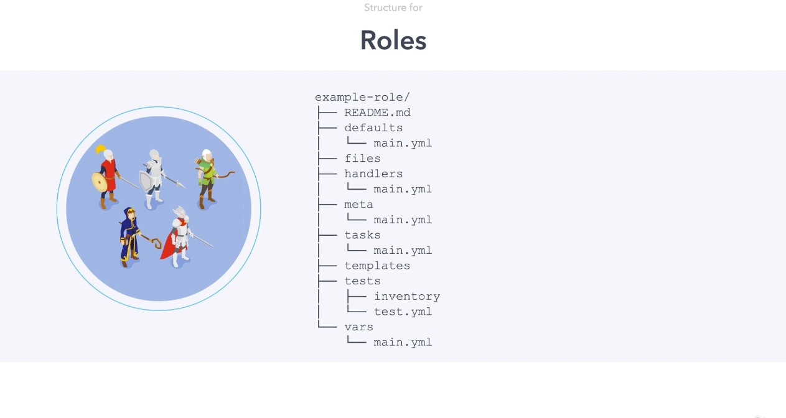

# Roles

Ansible Roles are an excellent approach to structure and group playbook tasks and associated components for ease of consumption.

Roles is a simple directory structure, with the top level directory defined in the the role



- `defaults` - default variables for role files
- `files` -  role files
- `handlers` - handlers
- `meta` - settings for the role and dependencies
- `tasks` - tasks
- `templates` - Jinja templates
- `tests` - Role Tests
- `vars` - Role Variables

The easier way to create a role structure is using `ansible-galaxy` init command

```bash
# ansible-galaxy init <role-name>
ansible-galaxy init nginx
```

As a result the folder structure will be created.